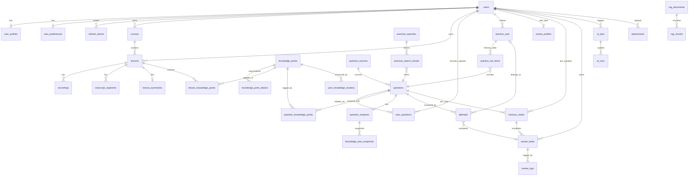

# ERD（核心关系）

Mermaid ER 图。所有主表含 `id(UUID) / created_at / updated_at`，按需 `deleted_at`（软删）。

## 关键约束

| 约束 | 说明 |
|---|---|
| `uq_memory_state (user_id, question_id)` | 每用户每题独立记忆状态 |
| `uq_user_question (user_id, question_id)` | 收藏/上传关系唯一，不复制题目 |
| `uq_segment_lesson_seq (lesson_id, sequence)` | 转写片段顺序唯一 |
| `uq_ps_item_pos (practice_set_id, position)` | 组题顺序冻结 |
| `uq_kp_alias (alias)` | 知识点别名指向唯一 canonical |
| `ix_ms_user_due (user_id, next_review_at)` | 今日任务查询 |
| `ix_rt_user_status_due (user_id, status, due_at)` | Planner 候选查询 |
| `ix_segments_lesson_start (lesson_id, start_ms)` | 转写时间跳转 |
| `content_hash` on questions | 跨来源题目去重 |

## 时区与时间

所有时间列使用 `UTCDateTime`（TypeDecorator）：存 naive-UTC、读出 tz-aware UTC；
用户本地日期（复习任务 scheduled_date）按 Asia/Shanghai +8 折算，生产由 profile.timezone 驱动。
